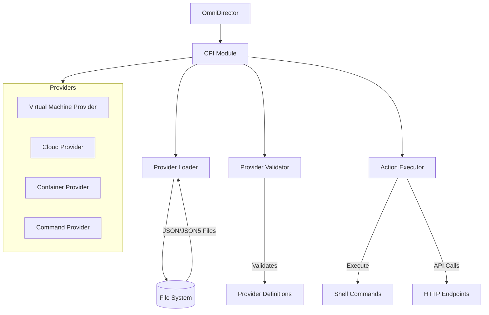
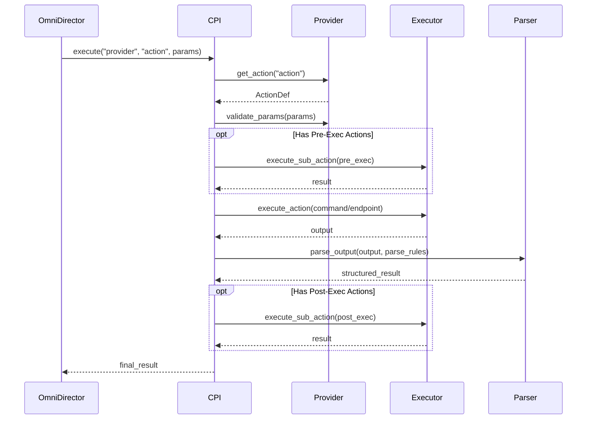

# Cloud Provider Interface (CPI) Module

## Table of Contents

- [Overview](#overview)
- [Architecture](#architecture)
- [Directory Structure](#directory-structure)
- [Provider Structure](#provider-structure)
- [Actions and Commands](#actions-and-commands)
- [Error Handling](#error-handling)
- [Integration with OmniDirector](#integration-with-omnidirector)

## Overview

The Cloud Provider Interface (CPI) module is a core component of OmniDirector that provides a modular framework for loading, validating, and executing actions from various providers. It enables OmniDirector to interact with different cloud services, virtualization technologies, containerization platforms, and system commands through a unified interface.

Key features:

- **Thread-safe provider management** using concurrent data structures
- **Parallel loading and validation** of providers for optimal performance
- **Comprehensive error tracking and reporting** with detailed diagnostics
- **Extensible action execution** with pre-exec and post-exec hooks
- **Robust parameter validation** for action invocation

## Architecture

The CPI module is built with a focus on thread safety, performance, and extensibility. Below is a high-level architecture diagram:



### Module Components

The CPI module consists of the following major components:

1. **Core CPI System**: Manages providers and coordinates operations
2. **Provider Loader**: Loads provider definitions from JSON/JSON5 files
3. **Provider Validator**: Validates provider structure and capabilities
4. **Action Executor**: Executes commands or API calls with parameter validation
5. **Parser**: Processes command output according to parsing rules
6. **Logger**: Provides enhanced logging with colors and symbols

### Execution Flow

The sequence below illustrates how a typical action is executed:



## Directory Structure

The CPI module is organized as follows within the OmniDirector project:

```
omni_director/
├── cpis/
│   ├── mod.rs             # Main module entry point
│   ├── error.rs           # Error types and handling
│   ├── executor.rs        # Action execution logic
│   ├── loader.rs          # Provider loading functionality
│   ├── logger.rs          # Enhanced logging utilities
│   ├── parser.rs          # Output parsing functionality
│   ├── provider.rs        # Provider data structures
│   └── validator.rs       # Provider validation logic
├── CPIs/                  # Directory for provider definition files
│   ├── virtualbox.json    # VirtualBox provider
│   ├── docker.json        # Docker provider
│   └── ...                # Other provider files
└── ...
```

## Provider Structure

CPI providers are defined in JSON or JSON5 files stored in the `./CPIs` directory. Each provider must follow a specific structure:

```json
{
  "name": "provider_name",
  "type": "provider_type",
  "default_settings": {
    "setting1": "value1",
    "setting2": "value2"
  },
  "actions": {
    "action_name": {
      "target": {
        "Command": "echo Hello, {name}!"
      },
      "params": ["name"],
      "parse_rules": {
        "type": "object",
        "patterns": {
          "output": {
            "regex": ".*",
            "optional": true
          }
        }
      }
    }
  }
}
```

### Required Fields

- `name`: Unique identifier for the provider (must be unique across all providers)
- `type`: Provider type (command, virt, cloud, container, endpoint)
- `actions`: Map of actions that the provider supports

### Provider Types

- `command`: Simple shell command execution
- `virt`: Virtualization providers (VirtualBox, VMware, etc.)
- `cloud`: Cloud service providers (AWS, Azure, GCP, etc.)
- `container`: Container orchestration (Docker, Kubernetes, etc.)
- `endpoint`: HTTP API endpoints

## Actions and Commands

Actions define operations that can be performed using a provider. Each action specifies:

- A command to execute or an endpoint to call
- Parameters required for the action
- Rules for parsing the output
- Optional pre-execution and post-execution actions

### Action Definition

```json
"create_vm": {
  "target": {
    "Command": "virtualbox create {name} --memory {memory} --disk {disk}"
  },
  "params": ["name", "memory", "disk"],
  "pre_exec": [
    {
      "target": {
        "Command": "virtualbox check_resources"
      },
      "parse_rules": {
        "type": "object",
        "patterns": {
          "available": {
            "regex": "Available: (yes|no)",
            "group": 1,
            "transform": "boolean"
          }
        }
      }
    }
  ],
  "parse_rules": {
    "type": "object",
    "patterns": {
      "id": {
        "regex": "VM ID: ([a-f0-9-]+)",
        "group": 1
      },
      "status": {
        "regex": "Status: (\\w+)",
        "group": 1
      }
    }
  }
}
```

### Parse Rules

Parse rules define how to extract structured data from command output. The CPI supports three types of parse rules:

1. **Object**: Extract key-value pairs into a JSON object
2. **Array**: Split output into multiple sections and process each section
3. **Properties**: Extract properties and related properties with more complex patterns

Each parse rule uses regular expressions to match and extract data from command output.

## Error Handling

The CPI module provides comprehensive error handling with detailed error messages. Common error types include:

- `ProviderNotFound`: When a requested provider doesn't exist
- `ActionNotFound`: When a requested action doesn't exist in a provider
- `MissingParameter`: When a required parameter is missing
- `ExecutionFailed`: When a command fails to execute
- `ParseError`: When output parsing fails
- `InvalidCpiFormat`: When a provider file has invalid format

Errors include detailed context information for easier debugging.

## Integration with OmniDirector

The CPI module is used throughout OmniDirector to interact with various infrastructure providers. Here's how to use it within the OmniDirector codebase:

```rust
use crate::cpis;
use std::collections::HashMap;
use serde_json::Value;

fn provision_infrastructure() -> Result<(), Box<dyn std::error::Error>> {
    // Initialize the CPI system
    let cpi_system = cpis::initialize()?;
    
    // Create parameters
    let mut params = HashMap::new();
    params.insert("name".to_string(), Value::String("example-vm".to_string()));
    params.insert("memory".to_string(), Value::Number(4096.into()));
    
    // Execute an action
    let result = cpi_system.execute("virtualbox", "create_vm", params)?;
    
    println!("VM created: {:?}", result);
    
    Ok(())
}
```

### CPI System Initialization

The CPI system is typically initialized once at OmniDirector startup. The initialization process:

1. Configures logging based on environment
2. Loads all provider definitions from the ./CPIs directory
3. Validates each provider's structure and required fields
4. Registers valid providers for use throughout the application

### Important Considerations

- **Provider Name Uniqueness**: Each provider must have a unique name within its file 
- **Thread Safety**: All CPI operations are thread-safe and can be called from multiple threads
- **Lazy Loading**: Providers are loaded and validated only once, then shared across all instances
- **Error Logging**: The CPI module includes detailed error reporting for easier debugging